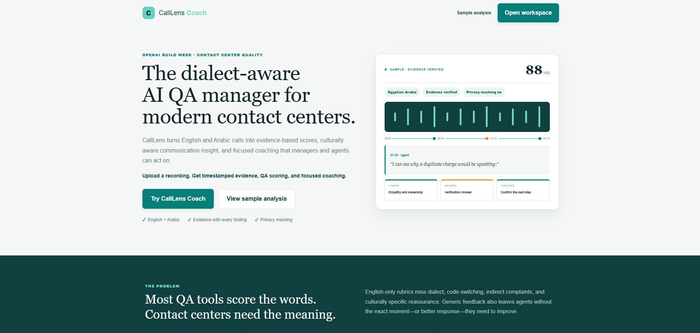
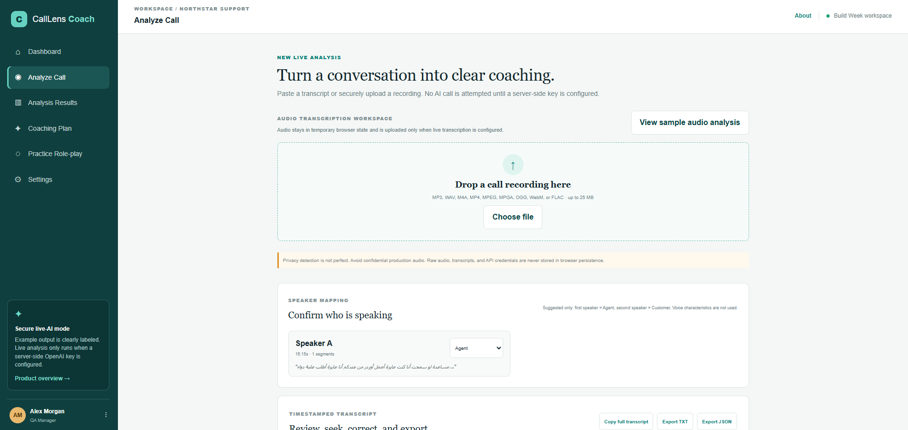
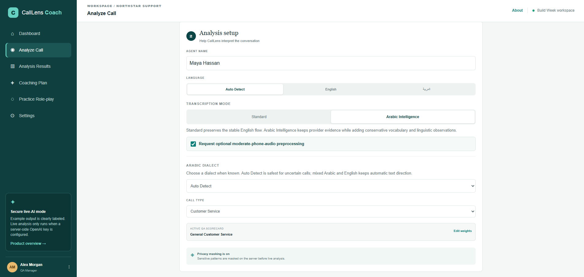
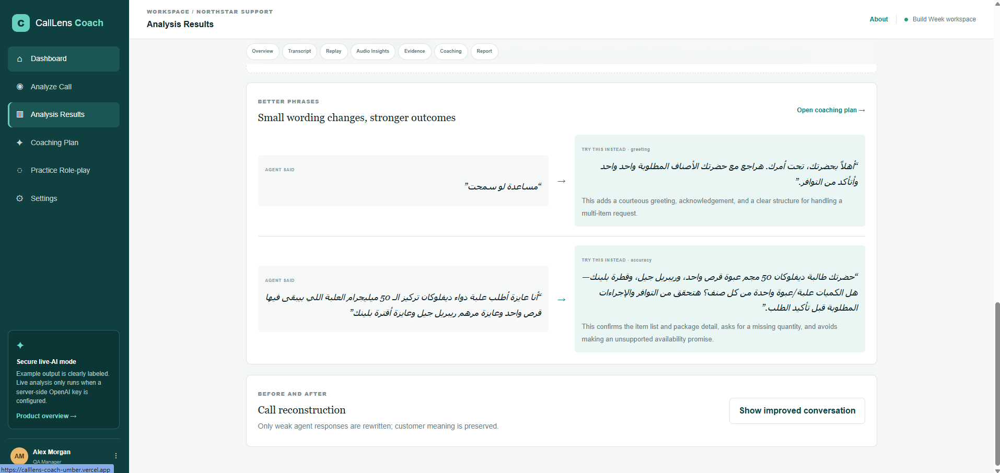
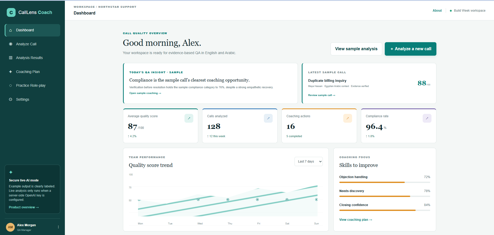
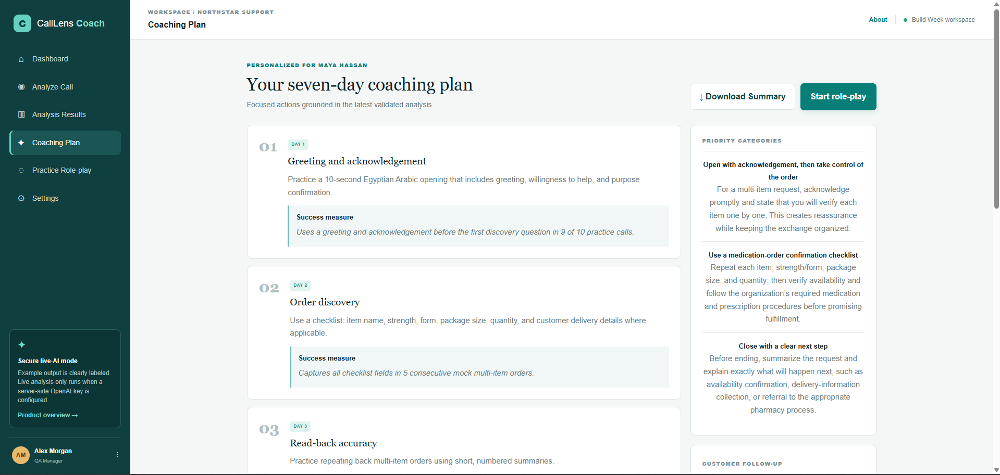

# 🎧 CallLens Coach

> AI-powered, evidence-based quality assurance and coaching for modern contact centers with **Arabic Intelligence**, transcription, QA scoring, analytics, and personalized coaching.



## 🚀 Live Demo

**Production App**

https://calllens-coach.vercel.app/

---

## Overview

CallLens Coach transforms customer conversations into structured coaching that managers and agents can immediately act on.

Unlike traditional QA tools that rely only on keywords and generic scorecards, CallLens understands conversational context, produces evidence-linked findings, and supports Arabic dialects with specialized linguistic analysis.

The platform combines:

- 🎙️ Speech transcription
- 🌍 Arabic dialect intelligence
- 📊 Evidence-based QA scoring
- 📈 Contact center analytics
- 🎯 Personalized coaching plans
- 🧠 AI-assisted communication improvement

---

# ✨ Key Features

## 🎙️ Audio Transcription

- Audio upload
- Speaker separation
- Timestamped transcripts
- Transcript editing
- TXT & JSON export



---

## 🌍 Arabic Intelligence

One of CallLens Coach's unique capabilities is dialect-aware analysis.

The platform can:

- Detect Arabic dialects
- Interpret culturally-specific phrases
- Recognize Egyptian Arabic expressions
- Detect code-switching
- Normalize vocabulary
- Produce evidence-linked linguistic observations



---

## 📊 QA Analysis

Each conversation is evaluated using structured scorecards instead of simple keyword matching.

Analysis includes:

- Executive summary
- Greeting evaluation
- Needs discovery
- Empathy
- Compliance
- Objection handling
- Evidence-linked findings
- Missed opportunities
- Critical call timeline



---

## 📈 Dashboard

Managers receive a live overview of:

- Average QA score
- Coaching actions
- Team trends
- Compliance rate
- Quality metrics
- Coaching priorities



---

## 🎯 Personalized Coaching

Instead of simply identifying mistakes, CallLens Coach generates practical coaching.

Outputs include:

- Better wording suggestions
- Before/after conversation reconstruction
- Estimated score improvement
- Seven-day coaching plan
- Ready-to-send follow-up messages



---

# 🏗️ Technology Stack

### Frontend

- React
- TypeScript
- Vite
- Tailwind CSS

### AI

- OpenAI GPT
- Whisper transcription
- Arabic Intelligence enrichment

### Backend

- Cloudflare Workers
- Drizzle ORM
- SQLite / D1

### Deployment

- Vercel

---

# Workflow

```
Upload Audio
      │
      ▼
Speech Transcription
      │
      ▼
Speaker Separation
      │
      ▼
Arabic Intelligence
      │
      ▼
Evidence-based QA
      │
      ▼
Analytics Dashboard
      │
      ▼
Coaching Recommendations
      │
      ▼
7-Day Coaching Plan
```

---

# Project Structure

```
app/
build/
db/
public/
tests/
worker/
docs/
```

---

# Running Locally

```bash
npm install
npm run dev
```

---

# Environment Variables

Create a `.env.local` file.

```env
OPENAI_API_KEY=your_api_key
```

---

# Future Improvements

- Live call analysis
- Real-time coaching
- CRM integrations
- Supervisor dashboards
- Team benchmarking
- Multi-language support
- AI role-play conversations
- Performance trend prediction

---

# Why CallLens Coach?

Traditional QA tools measure **what was said**.

CallLens Coach evaluates **what was meant**, **why it mattered**, and **how the conversation could improve**.

Its evidence-linked analysis, Arabic dialect intelligence, and coaching workflow help contact centers move beyond scorecards toward actionable performance improvement.

---

# Author

Built by **Norhan Rifaie**

OpenAI Build Week 2026

---

## License

MIT
